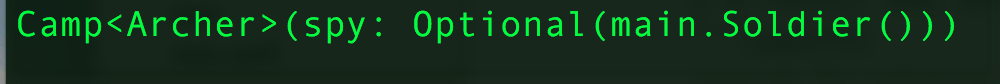

- `p. 191`: I think the example listed in the **Associated Type Chains** section is kind of redundent (There is a super protocol, `Superfighter`, which serve no other purpose except usded in type declairation in the subprotocols). I'd rather use another approach:
```{swift}
import Foundation

protocol Fighter {
    associatedtype Enemy
}

struct Soldier: Fighter {
    typealias Enemy = Archer
}

struct Archer: Fighter {
    typealias Enemy = Soldier
}

struct Camp<T: Fighter> {
    var spy: T.Enemy?

    init(spy: T.Enemy) {
        self.spy = spy
    }
}

var soldier = Soldier()
var c = Camp<Archer>(spy: soldier)

print(c) 
```
