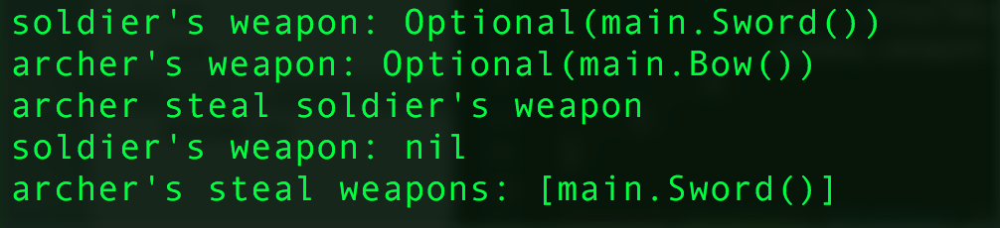
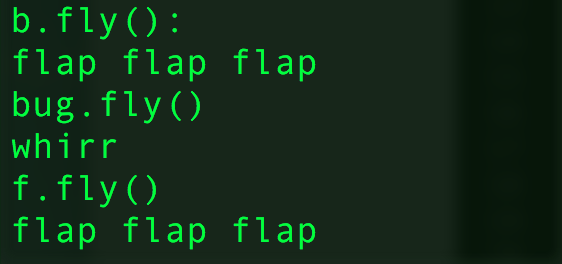
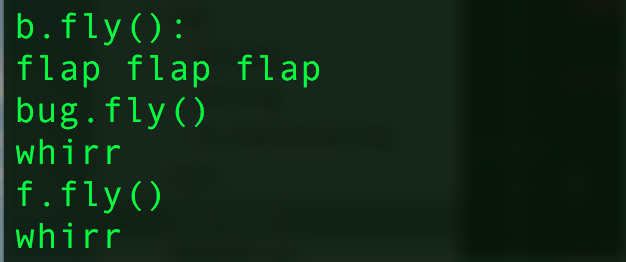

- `p. 191`: I think the example listed in the **Associated Type Chains** section is kind of redundent (There is a super protocol, `Superfighter`, which serve no other purpose except usded in type declairation in the subprotocols). I'd rather use another approach:
```{swift}
import Foundation

protocol Fighter {
    associatedtype Enemy
}

struct Soldier: Fighter {
    typealias Enemy = Archer
}

struct Archer: Fighter {
    typealias Enemy = Soldier
}

struct Camp<T: Fighter> {
    var spy: T.Enemy?

    init(spy: T.Enemy) {
        self.spy = spy
    }
}

var soldier = Soldier()
var c = Camp<Archer>(spy: soldier)

print(c) 
```


- `p.192`:
```{swift}
import Foundation

protocol Wieldable { }
struct Sword: Wieldable {}
struct Bow: Wieldable {}

protocol Fightable {
    associatedtype Weapon: Wieldable
}

protocol Fighter: Fightable {
    associatedtype Enemy: Fightable
    var stealWeapons:[Self.Enemy.Weapon] { get set }

    mutating func steal(weapon: Self.Enemy.Weapon, inout from: Self.Enemy)
}

struct Soldier: Fighter {
    typealias Weapon = Sword // Fightable
    typealias Enemy = Archer  // Fighter
    var weapon: Weapon? // Fighter
    var stealWeapons:[Enemy.Weapon]

    init(){
        self.weapon = Sword()
        self.stealWeapons = [Bow]()
    }

    mutating func steal(weapon: Bow, inout from enemy: Archer){
        if let weapon = enemy.weapon {
            self.stealWeapons.append(weapon)
            enemy.weapon = nil
        }
    }
}

struct Archer: Fighter {
    typealias Enemy = Soldier
    typealias Weapon = Bow
    var weapon: Weapon?
    var stealWeapons:[Enemy.Weapon]

    init(){
        self.weapon = Bow()
        self.stealWeapons = [Sword]()
    }

    mutating func steal(weapon: Sword, inout from enemy: Soldier){
        if let weapon = enemy.weapon {
            self.stealWeapons.append(weapon)
            enemy.weapon = nil
        }
    }
}

var soldier = Soldier()
var archer = Archer()

print("soldier's weapon: \(soldier.weapon)")
print("archer's weapon: \(archer.weapon)")

print("archer steal soldier's weapon")
archer.steal(soldier.weapon!, from: &soldier)
print("soldier's weapon: \(soldier.weapon)")
print("archer's steal weapons: \(archer.stealWeapons)")
```


- `p.200`: protocol extension
```{swift}
// extension is a way to add default implementation to the protocol
import Foundation

protocol Flier {
    //add this line to enable polymophism.
    // func fly() 
}

extension Flier {

    func fly(){
        print("flap flap flap")
    }
}

struct Bird: Flier {}
let b = Bird()
b.fly()

struct Insect: Flier {
    func fly(){
        print("whirr")
    }
}

let bug = Insect()
bug.fly()

let f:Flier = Insect() 
f.fly() // note that is need not to be polymophic (depand on declairation of the protocol)
```
no `fly` declairation in the protocol: 
<br/>


declare `fly` in the protocol:
<br/>

